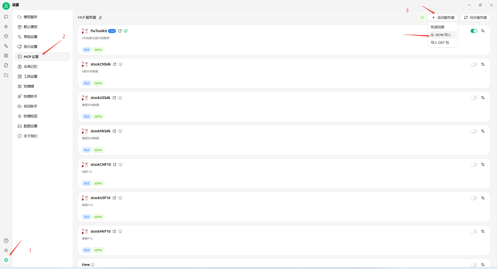
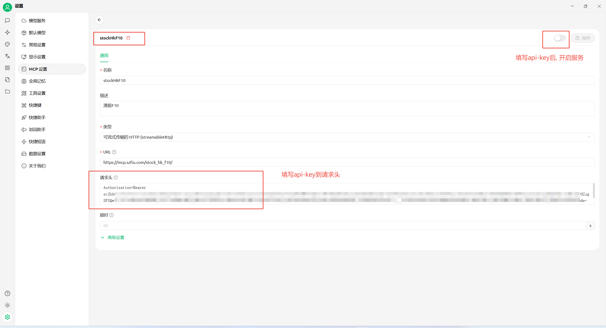

# 通过json导入
1. cherry-studio 默认只支持每次导入一个服务;
2. 导入后需要配置headers;

## 操作
导入json


填写api-key, 开启服务


## mcp server json 配置

#### 传输方式: streamable http
``` json
{
    "mcpServers": {
        "stockHkF10": {
            "type": "streamableHttp",
            "url": "https://mcp.szfiu.com/stock_hk_f10/",
            "description": "港股市场F10数据",
            "provider": "SZFIU",
            "providerUrl": "https://github.com/fiu-ai/mcp-server",
            "logoUrl": "https://www.szfiu.com/images/logo.png"
        }
    }
}
```

``` json
{
    "mcpServers": {
        "stockUSF10": {
            "type": "streamableHttp",
            "url": "https://mcp.szfiu.com/stock_us_f10/",
            "description": "美股市场F10数据",
            "provider": "SZFIU",
            "providerUrl": "https://github.com/fiu-ai/mcp-server",
            "logoUrl": "https://www.szfiu.com/images/logo.png"
        }
    }
}
```

``` json
{
    "mcpServers": {
        "stockCNF10": {
            "type": "streamableHttp",
            "url": "https://mcp.szfiu.com/stock_cn_f10/",
            "description": "A股市场F10数据",
            "provider": "SZFIU",
            "providerUrl": "https://github.com/fiu-ai/mcp-server",
            "logoUrl": "https://www.szfiu.com/images/logo.png"
        }
    }
}
```

``` json
{
    "mcpServers": {
        "stockHkSdk": {
            "type": "streamableHttp",
            "url": "https://mcp.szfiu.com/stock_hk_sdk/",
            "description": "港股市场SDK数据",
            "provider": "SZFIU",
            "providerUrl": "https://github.com/fiu-ai/mcp-server",
            "logoUrl": "https://www.szfiu.com/images/logo.png"
        }
    }
}
```

``` json
{
    "mcpServers": {
        "stockUSSdk": {
            "type": "streamableHttp",
            "url": "https://mcp.szfiu.com/stock_us_sdk/",
            "description": "美股市场SDK数据",
            "provider": "SZFIU",
            "providerUrl": "https://github.com/fiu-ai/mcp-server",
            "logoUrl": "https://www.szfiu.com/images/logo.png"
        }
    }
}
```

``` json
{
    "mcpServers": {
        "stockCNSdk": {
            "type": "streamableHttp",
            "url": "https://mcp.szfiu.com/stock_cn_sdk/",
            "description": "A股市场SDK数据",
            "provider": "SZFIU",
            "providerUrl": "https://github.com/fiu-ai/mcp-server",
            "logoUrl": "https://www.szfiu.com/images/logo.png"
        }
    }
}
```

``` json
{
    "mcpServers": {
        "fiuToolkit": {
            "type": "streamableHttp",
            "url": "https://mcp.szfiu.com/toolkit/",
            "description": "FIU检索证券代码服务",
            "provider": "SZFIU",
            "providerUrl": "https://github.com/fiu-ai/mcp-server",
            "logoUrl": "https://www.szfiu.com/images/logo.png"
        }
    }
}
```

#### 传输方式: sse
``` json
{
    "mcpServers": {
        "stockHkF10SSE": {
            "type": "sse",
            "url": "https://mcp.szfiu.com/sse/stock_hk_f10/",
            "description": "港股市场F10数据",
            "provider": "SZFIU",
            "providerUrl": "https://github.com/fiu-ai/mcp-server",
            "logoUrl": "https://www.szfiu.com/images/logo.png"
        }
    }
}
```

``` json
{
    "mcpServers": {
        "stockUSF10SSE": {
            "type": "sse",
            "url": "https://mcp.szfiu.com/sse/stock_us_f10/",
            "description": "美股市场F10数据",
            "provider": "SZFIU",
            "providerUrl": "https://github.com/fiu-ai/mcp-server",
            "logoUrl": "https://www.szfiu.com/images/logo.png"
        }
    }
}
```

``` json
{
    "mcpServers": {
        "stockCNF10SSE": {
            "type": "sse",
            "url": "https://mcp.szfiu.com/sse/stock_cn_f10/",
            "description": "A股市场F10数据",
            "provider": "SZFIU",
            "providerUrl": "https://github.com/fiu-ai/mcp-server",
            "logoUrl": "https://www.szfiu.com/images/logo.png"
        }
    }
}
```

``` json
{
    "mcpServers": {
        "stockHkSdkSSE": {
            "type": "sse",
            "url": "https://mcp.szfiu.com/sse/stock_hk_sdk/",
            "description": "港股市场SDK数据",
            "provider": "SZFIU",
            "providerUrl": "https://github.com/fiu-ai/mcp-server",
            "logoUrl": "https://www.szfiu.com/images/logo.png"
        }
    }
}
```

``` json
{
    "mcpServers": {
        "stockUSSdkSSE": {
            "type": "sse",
            "url": "https://mcp.szfiu.com/sse/stock_us_sdk/",
            "description": "美股市场SDK数据",
            "provider": "SZFIU",
            "providerUrl": "https://github.com/fiu-ai/mcp-server",
            "logoUrl": "https://www.szfiu.com/images/logo.png"
        }
    }
}
```

``` json
{
    "mcpServers": {
        "stockCNSdkSSE": {
            "type": "sse",
            "url": "https://mcp.szfiu.com/sse/stock_cn_sdk/",
            "description": "A股市场SDK数据",
            "provider": "SZFIU",
            "providerUrl": "https://github.com/fiu-ai/mcp-server",
            "logoUrl": "https://www.szfiu.com/images/logo.png"
        }
    }
}
```

``` json
{
    "mcpServers": {
        "fiuToolkitSSE": {
            "type": "sse",
            "url": "https://mcp.szfiu.com/sse/toolkit/",
            "description": "FIU检索证券代码服务",
            "provider": "SZFIU",
            "providerUrl": "https://github.com/fiu-ai/mcp-server",
            "logoUrl": "https://www.szfiu.com/images/logo.png"
        }
    }
}
```
