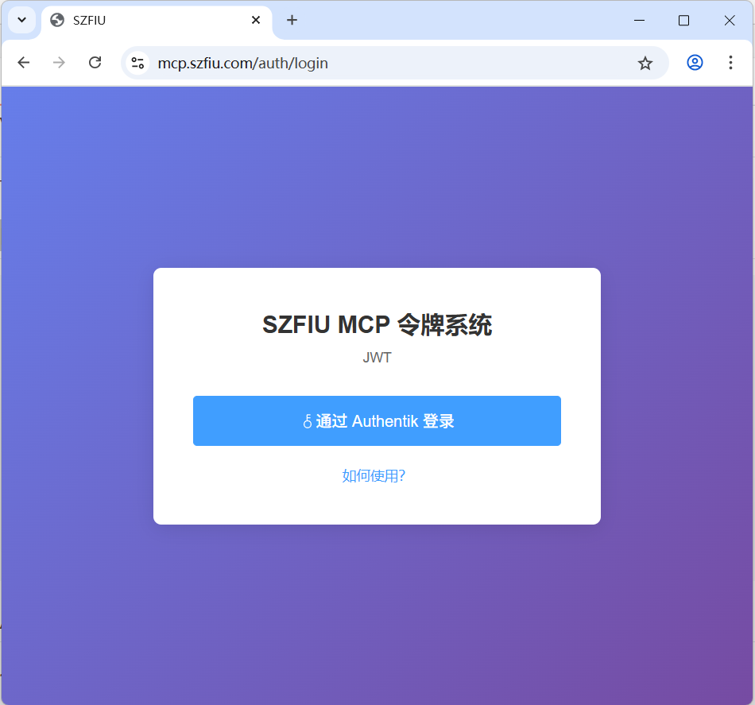
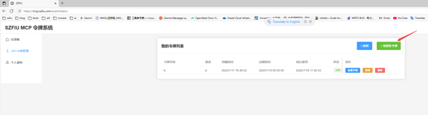

## FIU MCP Server
A Model Context Protocol (MCP) server implementation for FIU AI services.

深圳市融聚汇信息科技有限公司，提供全球金融市场行情数据，同时一站式提供上市公司基本面信息、新闻舆情，帮助深入研究、跟踪各类投资标的动态，以及进行指标分析和量化策略回测。

## FIU MCP API Key
To use the FIU MCP Server, you need to have a Variflight API key. You can get it from [here](https://mcp.szfiu.com/auth/login).






## Available Tools
### 港股市场f10 MCP

``` json
{
    "mcpServers": {
        "stockHkF10": {
            "description": "港股市场F10数据",
            "transport": "streamable_http",
            "url": "https://mcp.szfiu.com/stock_hk_f10/",
            "headers": {
                "Authorization": "Bearer {api_key}"
            }
        }
    }
}
```

查询港股市场f10数据, 包括:公司简况,财务, 基础信息,基金等类型数据.

详情请见:[工具列表](https://doc.weixin.qq.com/doc/w3_AbgA3gZ5AK0CNpjKCSFZ6TuOKiTNO?scode=AFgAVQd2AAsnhq3NL2AbgA3gZ5AK0)

### 美股市场f10 MCP
``` json
{
    "mcpServers": {
        "stockUsF10": {
            "description": "美股市场F10数据",
            "transport": "streamable_http",
            "url": "https://mcp.szfiu.com/stock_us_f10/",
            "headers": {
                "Authorization": "Bearer {api_key}"
            }
        }
    }
}
```

查询美股市场f10数据, 包括:公司简况,财务, 基础信息,基金等类型数据.

详情请见:[工具列表](https://doc.weixin.qq.com/doc/w3_AbgA3gZ5AK0CN8MwG0JhsQP6m0wFm?scode=AFgAVQd2AAs4cJBJ49AbgA3gZ5AK0)

### A股市场f10 MCP
``` json
{
    "mcpServers": {
        "stockCnF10": {
            "description": "A股市场F10数据",
            "transport": "streamable_http",
            "url": "https://mcp.szfiu.com/stock_cn_f10/",
            "headers": {
                "Authorization": "Bearer {api_key}"
            }
        }
    }
}
```

查询A股市场f10数据, 包括:公司简况,财务, 基础信息等类型数据.

详情请见:[工具列表](https://doc.weixin.qq.com/doc/w3_AbgA3gZ5AK0CNIm8zMODNTve7jgwV?scode=AFgAVQd2AAs3Et01DwAbgA3gZ5AK0)

### 港股市场SDK Mcp
``` json
{
    "mcpServers": {
        "stockHkSdk": {
            "description": "港股市场SDK数据",
            "transport": "streamable_http",
            "url": "https://mcp.szfiu.com/stock_hk_sdk/",
            "headers": {
                "Authorization": "Bearer {api_key}"
            }
        }
    }
}
```

查询港股市场数据, 包括: 基础数据, 码表, 大盘统计, 盘口数据, 资金分析,排行榜,图表K线, 行业数据,指数信息, 沪深港股通, 衍生品, 筹码分布, 衍生品等类型数据.

详情请见:[工具列表](https://doc.weixin.qq.com/doc/w3_AbgA3gZ5AK0CNSuAFX22uSE0M3H4P?scode=AFgAVQd2AAsz4Ilf6eAbgA3gZ5AK0) 

### 美股市场SDK Mcp
``` json
{
    "mcpServers": {
        "stockUsSdk": {
            "description": "美股市场SDK数据",
            "transport": "streamable_http",
            "url": "https://mcp.szfiu.com/stock_us_sdk/",
            "headers": {
                "Authorization": "Bearer {api_key}"
            }
        }
    }
}
```

查询美股市场数据, 包括: 基础数据, 码表, 大盘统计, 盘口数据, 资金分析,排行榜,图表K线, 行业数据,指数信息, 沪深港股通, 衍生品, 筹码分布, 衍生品等类型数据.

详情请见:[工具列表](https://doc.weixin.qq.com/doc/w3_AbgA3gZ5AK0CNAogSqbT4RnGImtJf?scode=AFgAVQd2AAsttfxFnjAbgA3gZ5AK0)

### A股市场SDK Mcp
``` json
{
    "mcpServers": {
        "stockCnSdk": {
            "description": "A股市场SDK数据",
            "transport": "streamable_http",
            "url": "https://mcp.szfiu.com/stock_cn_sdk/",
            "headers": {
                "Authorization": "Bearer {api_key}"
            }
        }
    }
}
```

查询A股市场数据, 包括: 码表, 大盘统计, 盘口数据, 资金分析,排行榜,图表K线, 行业数据,指数信息, 沪深港股通, 衍生品, 筹码分布等类型数据.

详情请见:[工具列表](https://doc.weixin.qq.com/doc/w3_AbgA3gZ5AK0CNkjJRr16kQvuskS5l?scode=AFgAVQd2AAsp0HxePhAbgA3gZ5AK0)

### FIU Toolkit Mcp
``` json
{
    "mcpServers": {
        "szfiuToolkit": {
            "description": "szfiu工具",
            "transport": "streamable_http",
            "url": "https://mcp.szfiu.com/toolkit/"
        }
    }
}
```

里面有检索证券代码的工具.

## Usage
常用json配置如下:

``` json
{
    "mcpServers": {
        "stockHkF10": {
            "transport": "streamable_http",
            "url": "https://mcp.szfiu.com/stock_hk_f10/",
            "headers": {
                "Authorization": "Bearer {api_key}"
            }
        },
        "stockUsF10": {
            "transport": "streamable_http",
            "url": "https://mcp.szfiu.com/stock_us_f10/",
            "headers": {
                "Authorization": "Bearer {api_key}"
            }
        },
        "stockCnF10": {
            "transport": "streamable_http",
            "url": "https://mcp.szfiu.com/stock_cn_f10/",
            "headers": {
                "Authorization": "Bearer {api_key}"
            }
        },
        "stockHkSdk": {
            "transport": "streamable_http",
            "url": "https://mcp.szfiu.com/stock_hk_sdk/",
            "headers": {
                "Authorization": "Bearer {api_key}"
            }
        },
        "stockUsSdk": {
            "transport": "streamable_http",
            "url": "https://mcp.szfiu.com/stock_us_sdk/",
            "headers": {
                "Authorization": "Bearer {api_key}"
            }
        },
        "stockCnSdk": {
            "transport": "streamable_http",
            "url": "https://mcp.szfiu.com/stock_cn_sdk/",
            "headers": {
                "Authorization": "Bearer {api_key}"
            }
        }
    }
}
```

### 在cherry-studio中使用
1. 手动添加
   

2. json导入方式.
``` json
{
    "mcpServers": {
        "stockHkF10": {
            "type": "streamableHttp",
            "baseUrl": "https://mcp.szfiu.com/stock_hk_f10/",
            "headers": {
                "Authorization": "Bearer {api_key}"
            }
        },
        "stockUsF10": {
            "type": "streamableHttp",
            "url": "https://mcp.szfiu.com/stock_us_f10/",
            "headers": {
                "Authorization": "Bearer {api_key}"
            }
        },
        "stockCnF10": {
            "type": "streamableHttp",
            "baseUrl": "https://mcp.szfiu.com/stock_cn_f10/",
            "headers": {
                "Authorization": "Bearer {api_key}"
            }
        },
        "stockHkSdk": {
            "type": "streamableHttp",
            "baseUrl": "https://mcp.szfiu.com/stock_hk_sdk/",
            "headers": {
                "Authorization": "Bearer {api_key}"
            }
        },
        "stockUsSdk": {
            "type": "streamableHttp",
            "baseUrl": "https://mcp.szfiu.com/stock_us_sdk/",
            "headers": {
                "Authorization": "Bearer {api_key}"
            }
        },
        "stockCnSdk": {
            "type": "streamableHttp",
            "baseUrl": "https://mcp.szfiu.com/stock_cn_sdk/",
            "headers": {
                "Authorization": "Bearer {api_key}"
            }
        }
    }
}
```

## 智能助手

system prompt:
``` shell
你是金融助手 - 查询数据前, 请先使用工具确认证券代码 - 使用工具查询实时数据 分析用户问题:
```

效果:


## note
1. 填写配置, 注意url 需要 '/' 结尾;
2. api_key 需要替换成自己的;
3. 在工具中启用想要工具;
